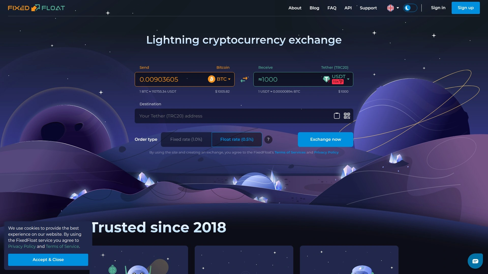
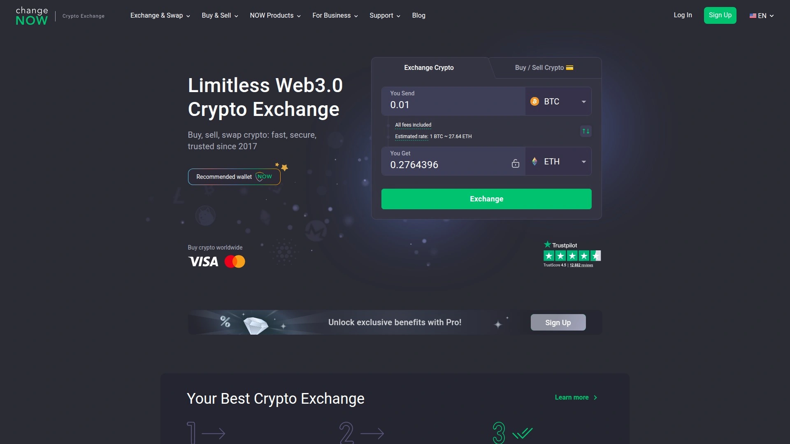
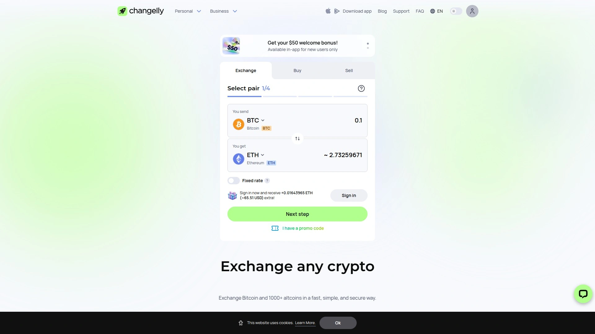
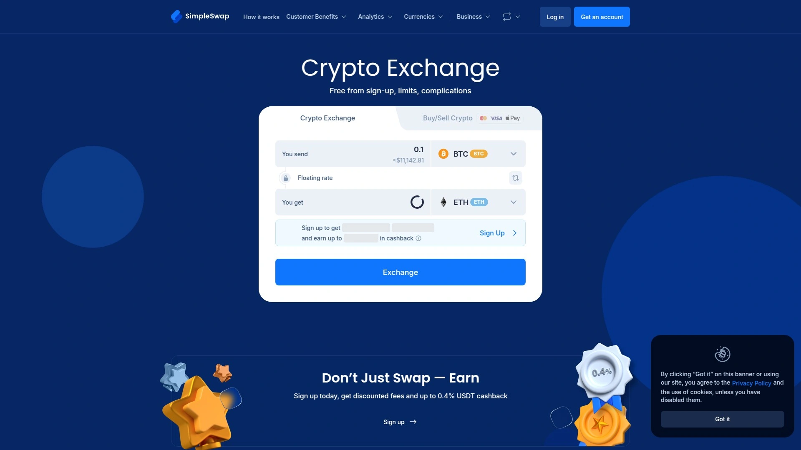
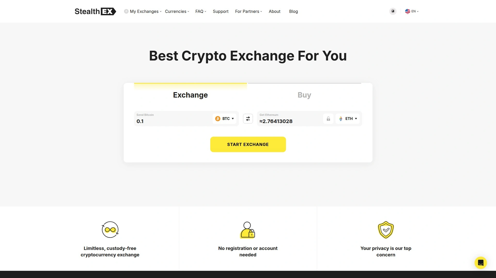
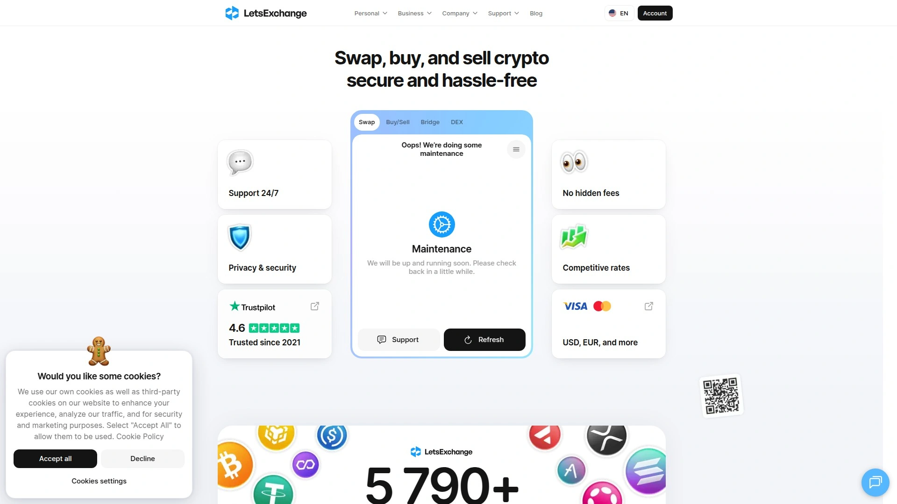
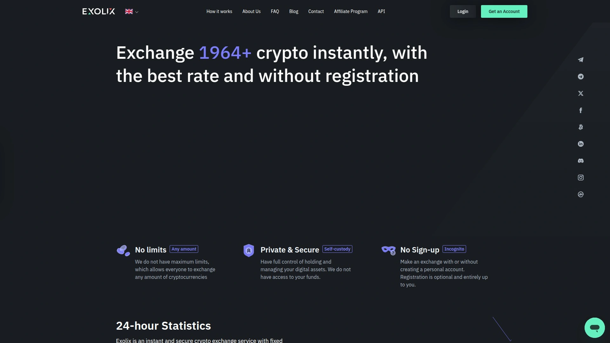
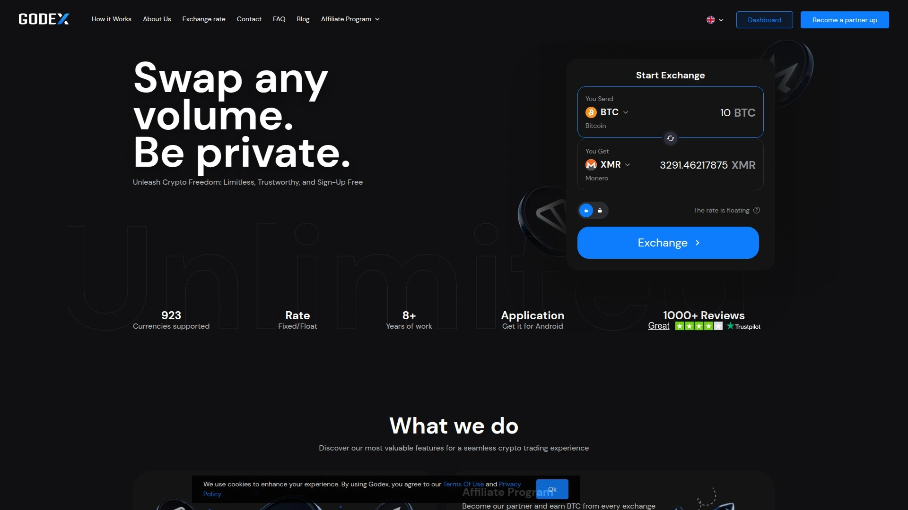
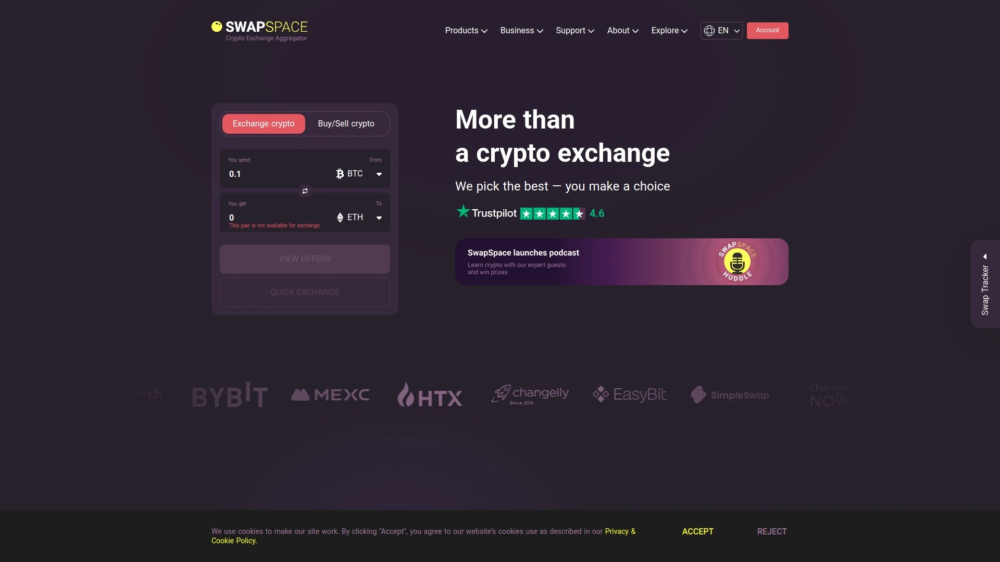
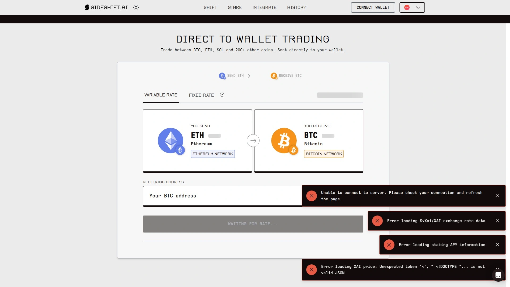

# No More Manual Trading! Recommend 10 Automatic Cryptocurrency Exchange Game-Changers!

If you're still opening three browser tabs just to swap Bitcoin for Ethereum, checking rates on one site, logging into another exchange, and then waiting hours for confirmations—you're doing it the hard way. The world of instant cryptocurrency exchanges has evolved into something surprisingly straightforward: you pick two coins, paste your wallet address, send funds, and boom—new crypto appears in your wallet within minutes. No accounts to remember, no passwords to reset at 2 AM, no twelve-step verification processes that make you question your life choices.

These platforms are built for people who value time and simplicity over corporate bureaucracy. They handle everything from Bitcoin and Ethereum to obscure altcoins you discovered on a Reddit thread last Tuesday. Most operate without asking for your life story, which means you can swap $50 or $5,000 worth of crypto while wearing pajamas and eating cereal—nobody judges, nobody asks questions.

## **[FixedFloat](https://ff.io)**

The platform that treats crypto swapping like it should be: quick and honest.

FixedFloat has been around since 2018, which in crypto years makes it practically ancient. The site built its reputation on offering two distinct exchange methods that actually make sense when you think about them. With their **fixed rate** option, you lock in the exact amount you'll receive for 10 minutes—pay 1% plus network fees, and what you see is what you get. If the market suddenly jumps or crashes by more than 1.2% before your transaction hits the blockchain, they'll offer you a refund or let you continue at the new market rate.

Their **float rate** is for people who like living dangerously—or at least don't mind a bit of market fluctuation. You pay just 0.5% plus network fees, and the final exchange rate gets locked in after your transaction receives the required blockchain confirmations. If the market goes up during that window, you get more crypto; if it drops, you get less. It's gambling without the slot machines. The platform processes swaps automatically, supports dozens of cryptocurrencies, and maintains a straightforward FAQ section that doesn't require a PhD in blockchain to understand.

For traders who want transparency without the runaround, FixedFloat delivers exactly what it promises. The interface shows recent transactions in real-time, so you can see other people successfully swapping coins while you make your decision. No hidden fees, no surprise charges that appear after you've already committed—just clear percentages stated upfront.

## **[ChangeNOW](https://changenow.io)**

When you need to swap crypto without creating yet another account you'll forget about.

ChangeNOW operates on a simple premise: you shouldn't need to register for an exchange service just to swap coins. The platform supports over 1,500 cryptocurrencies, which covers everything from mainstream Bitcoin and Ethereum to tokens most people have never heard of. Their non-custodial model means your funds never sit on their servers—you send from your wallet directly to another wallet, and ChangeNOW just facilitates the middle part.

**What makes ChangeNOW practical:** The swap process typically takes around 5 minutes when network conditions are normal. You don't need to verify your identity for standard transactions, though they reserve the right to request KYC if something looks suspicious. The platform operates 24/7 with live customer support, which comes in handy when you're panicking because you accidentally sent funds to the wrong address at 3 AM.

Transaction fees are built into the exchange rate rather than listed as separate line items, which some users find cleaner and others find less transparent. The platform works with multiple liquidity providers to source competitive rates, though you won't always know which provider you're using for any given swap. For people who prioritize speed and convenience over knowing every technical detail, ChangeNOW handles the basics reliably.

## **[Changelly](https://changelly.com)**

The crypto swap platform that's been around long enough to know what it's doing.

Founded in 2015, Changelly predates most of the competition by several years. The platform lets you buy, sell, and trade more than 1,000 cryptocurrencies without requiring you to store funds on their servers. Integration partnerships with hardware wallets like Ledger and Trezor mean you can initiate swaps directly from your cold storage device.

Changelly operates with tiered KYC requirements that depend on transaction volume. For basic verification, most users only need to provide a passport to trade up to 10,000 EUR within 48 hours. High-volume traders dealing with larger amounts face advanced KYC that includes video verification calls and additional documentation. The platform markets itself as one of the easiest exchanges to get verified, which matters if you're planning to move serious money.

The service offers both a website interface and mobile apps for iOS and Android, so you can swap coins while standing in line at the grocery store. Average swap times range from 5 to 40 minutes depending on blockchain congestion and the specific cryptocurrencies involved. Fees top out at 0.25% for most transactions, plus whatever network fees the blockchain charges for processing. Changelly's multi-source pricing model sometimes means longer wait times compared to platforms that only work with one liquidity provider.

## **[SimpleSwap](https://simpleswap.io)**

No frills, no complications, just straightforward crypto swapping.

SimpleSwap launched in 2018 with a deliberately minimalist approach to cryptocurrency exchanges. The platform supports over 1,500 cryptocurrencies with no signup required and no minimum swap amount beyond whatever the network fee costs. You can execute both floating rate and fixed rate exchanges depending on your risk tolerance and market outlook.

**Core functionality:** As a non-custodial service, SimpleSwap never holds your funds—they pass through the platform during the swap process and move directly to your destination wallet. The team continuously adds new tokens and coins, particularly smaller altcoins that major exchanges ignore. Customer feedback on social media and review sites generally praises the service's reliability and simplicity.

The platform's simplified user interface makes it accessible for crypto beginners who find Binance's 47 different trading screens overwhelming. However, the exchange process sometimes takes longer than competitors—transactions can stretch beyond the typical 5-10 minute window during network congestion. SimpleSwap doesn't support crypto-to-fiat conversions, so you can't directly cash out to dollars or euros. For pure crypto-to-crypto swaps where you value simplicity over speed, SimpleSwap delivers consistently.

## **[StealthEX](https://stealthex.io)**

For people who take privacy seriously and don't want exchanges collecting data.

StealthEX positions itself firmly in the privacy-focused segment of instant exchanges. Founded in 2018, the platform offers limitless swaps across 1,400+ cryptocurrencies without requiring registration or storing user funds. Their non-custodial model means coins flow directly from your wallet to the destination address without sitting on StealthEX's servers.

The platform's biggest selling point is anonymity—they don't collect personal information for transactions up to $700. Beyond that threshold, KYC verification kicks in, which somewhat contradicts their "privacy-first" marketing. Transaction processing times aren't publicly specified, though user reports suggest swaps complete within the industry-standard 5-20 minute range depending on blockchain confirmation speeds.

StealthEX offers mobile apps for both iOS and Android, letting you execute private swaps from your phone. The platform supports cross-chain exchanges, so you can swap Bitcoin for Ethereum or move between entirely different blockchain ecosystems. Fee structures aren't detailed prominently on their site—costs are built into exchange rates rather than listed as separate percentages. For traders who prioritize anonymity and accept the trade-off of less transparent pricing, StealthEX provides a workable solution.

## **[LetsExchange](https://letsexchange.io)**

When you need access to obscure altcoins that mainstream exchanges won't touch.

LetsExchange dominates the competition in one specific metric: asset variety. The platform supports over 5,800 cryptocurrencies with 21+ million trading pairs, which covers basically every token that exists on a legitimate blockchain. This makes LetsExchange particularly valuable for traders working with newer or region-specific coins that Coinbase and Kraken don't list.

**Distinctive features:** The platform operates with no registration requirements and no upper limits on transaction sizes. LetsExchange indexes multiple liquidity providers to find optimal rates for each swap, rather than locking you into a single price source. They support cross-chain exchanges and DEX swaps, plus conversions between the same coin running on different blockchain networks—like swapping USDT on Binance Smart Chain for USDT on Solana.

Average swap times hover around 5 minutes when everything runs smoothly. The platform also supports buying and selling crypto for approximately 60 fiat currencies, which adds flexibility if you need to cash out to your local currency. Customer service includes personalized support, which beats automated chatbots that offer responses like "Have you tried turning it off and on again?". For traders who regularly work with unusual tokens or need cross-chain functionality, LetsExchange's comprehensive asset support justifies overlooking its slightly cluttered interface.

## **[Exolix](https://exolix.com)**

Anonymous swaps with fixed rates and no limits on transaction sizes.

Exolix launched in 2018 as a registration-free instant exchange supporting 500+ cryptocurrencies. The platform offers both fixed and floating rate options—fixed rates lock in your exchange price upfront, while floating rates finalize after your transaction confirms on the blockchain. Neither method imposes upper limits on swap amounts, which matters if you're moving significant capital.

Security measures include no KYC requirements for standard transactions and complete anonymity for users who want to keep their crypto activity private. The platform provides 24/7 transaction statistics and customer support, so you can track your swap progress or get help if something goes wrong. Exolix recently launched a DEX swap feature that operates across 9 major blockchain networks including Ethereum, Optimism, and BNB Chain.

**Drawbacks to consider:** As a relatively newer platform, Exolix doesn't have the multi-year track record of older competitors. The service doesn't support crypto-to-fiat conversions—it's purely for swapping one cryptocurrency to another. Advanced trading features are minimal compared to traditional exchanges, which limits usefulness for day traders running complex strategies. For straightforward crypto swaps where anonymity and rate flexibility matter, Exolix handles the basics competently.

## **[Godex](https://godex.io)**

Fixed-rate exchanges with a focus on speed and simplicity.

Godex.io entered the instant exchange market with a deliberately streamlined approach. The platform supports 923 cryptocurrencies including Ripple, Bitcoin, IOTA, Monero, Ethereum, and Zcash. Unlike some competitors that offer multiple rate options, Godex operates exclusively with fixed rates—the exchange rate you see when starting your transaction is the rate you get when it completes.

**Transaction characteristics:** Swaps typically process within 5 to 30 minutes depending on blockchain network conditions. The platform requires no KYC verification and collects no personal data for any transaction size. This makes Godex attractive for privacy-conscious traders who want to avoid identity verification processes. The site displays price fluctuations for top cryptocurrencies over the past 24 hours, helping you time your swaps around market movements.

Godex doesn't support crypto-to-fiat exchanges, so you can't convert Bitcoin directly to dollars or euros. The platform also lacks mobile apps, which forces you to use a web browser for all transactions. Customer feedback generally highlights reliability and competitive rates as Godex's strongest points. For traders who prefer fixed-rate certainty and don't need mobile functionality, Godex provides a solid if unspectacular service.

## **[SwapSpace](https://swapspace.co)**

An aggregator that searches multiple exchanges to find you the best rates.

Rather than operating as a standalone exchange, SwapSpace functions as an aggregator that compares rates across 39 partner platforms. This approach lets you access 3,600+ cryptocurrencies and compare prices from multiple sources before committing to a swap. The platform launched in 2019 specifically to make cryptocurrency swapping more convenient and time-efficient.

SwapSpace's aggregator model delivers competitive pricing because it queries multiple exchanges simultaneously and displays the best available rate. The swap process follows four straightforward steps: select your currency pair, enter your receiving wallet address, review aggregated offers, and send funds to complete the exchange. Integration with 12 different crypto exchanges means you benefit from broad market coverage without needing accounts on each individual platform.

**Limitations to note:** Users must maintain their own digital wallet since SwapSpace doesn't provide wallet services. The platform doesn't support crypto-to-fiat trading, which complicates withdrawing funds to traditional currency. Transactions can take longer than direct exchanges because you're routing through a third-party platform rather than executing swaps on native infrastructure. For traders who prioritize getting the absolute best rate and don't mind the extra steps, SwapSpace's aggregator model proves valuable.

## **[SideShift.ai](https://sideshift.ai)**

Direct wallet-to-wallet trading with AI-powered liquidity routing.

SideShift.ai operates as a non-custodial exchange supporting 200+ cryptocurrencies across 42 blockchains. The platform enables direct wallet-to-wallet swaps without account creation or KYC verification for most transactions. Monthly transaction volume exceeds $37.5 million, which provides decent liquidity for trades.

The exchange offers two rate structures: **variable rates** that remain flexible until you send funds, potentially capturing favorable price movements; and **fixed rates** that lock in your exchange price for 15 minutes once you generate a quote. Fixed rate trading works best during volatile market conditions or for larger transactions where price certainty matters. The platform supports swaps between native Bitcoin and both EVM and non-EVM tokens, handling cross-chain complexity behind the scenes.

SideShift.ai's native token XAI enables revenue sharing through daily staking rewards—the platform distributes 25% of revenue to token stakers. Security measures include cold storage policies and live support available 24/7. Major integrations with wallets like Trezor, Edge Wallet, and Bitcoin.com let you initiate swaps directly from your hardware or software wallet interface. For blockchain developers, SideShift provides API access and embeddable widgets for integrating swap functionality into apps and websites.

## FAQ

**How long do instant cryptocurrency exchanges actually take?**

Most platforms complete swaps within 5 to 30 minutes, though timing depends on blockchain network congestion and the specific coins you're exchanging. Bitcoin transactions take longer than Ethereum or Solana swaps because of slower block confirmation times. Fixed-rate exchanges sometimes process faster than floating-rate options since the platform locks in pricing immediately rather than waiting for final blockchain confirmations.

**Do I need to verify my identity to use instant exchanges?**

Many platforms like SimpleSwap, StealthEX, and SideShift.ai don't require KYC for standard transactions. However, larger swaps or suspicious activity can trigger verification requests even on "no-KYC" platforms. If you're moving thousands of dollars in crypto, expect to provide identification documents at some point.

**Are instant exchanges safe or are they going to steal my crypto?**

Non-custodial platforms don't hold your funds, which minimizes theft risk—your coins move directly from your wallet to the destination address. Platforms with multi-year operating histories like FixedFloat (since 2018), Changelly (since 2015), and ChangeNOW have processed billions in transactions without major security breaches. That said, always test with small amounts first and verify the receiving address is correct before sending large sums.

## Conclusion

The instant cryptocurrency exchange market has matured significantly—you no longer need to compromise between speed, security, and reasonable fees. Whether you're swapping mainstream coins or hunting for obscure altcoins, these platforms handle the technical complexity while you focus on actually using your crypto. [FixedFloat](https://ff.io) remains the top choice for traders who value transparent pricing and reliable service that's been battle-tested since 2018. The platform's dual-rate structure lets you pick certainty or flexibility depending on market conditions, and their straightforward fee model means no surprises when your swap completes.
